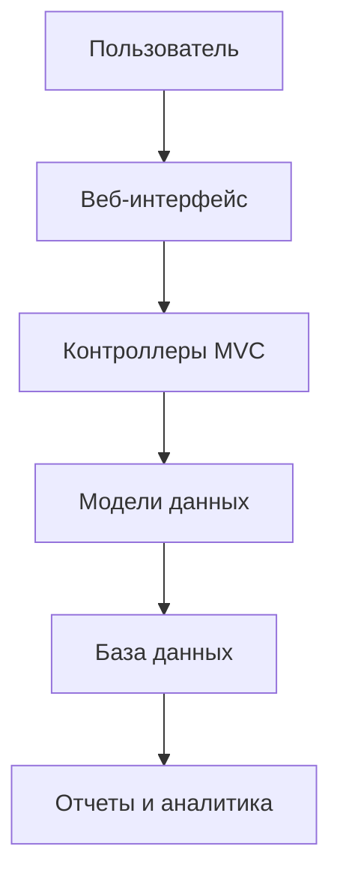

<!-- Шапка с баннером -->
<div align="center">

# 🏛️ University Management System


**Профессиональная система управления университетом на ASP.NET Core MVC**


</div>

---

## 📖 О проекте

**University Management System** — это полнофункциональное веб-приложение для администрирования учебного заведения. Система предоставляет современный интерфейс для управления факультетами, группами и студентами с поддержкой всех CRUD операций.

<div align="center">




## ✨ Ключевые функции

### 🎓 Управление образовательным процессом
| Модуль | Описание | Статус |
|--------|----------|--------|
| 🎯 **Факультеты** | Полное управление факультетами университета | ✅ Готово |
| 👥 **Группы** | Создание и редактирование учебных групп | ✅ Готово |
| 👨‍🎓 **Студенты** | Управление студенческими данными | ✅ Готово |
| 📊 **Панель аналитики** | Визуализация статистики | 🚧 В разработке |
| 📅 **Расписание** | Управление учебным расписанием | 🔜 Планируется |

### 🔧 Технические возможности
- ✅ **Полный CRUD** для всех сущностей
- ✅ **Поиск и фильтрация** с пагинацией
- ✅ **Валидация данных** на стороне сервера и клиента
- ✅ **Адаптивный дизайн** (мобильные устройства + десктоп)
- ✅ **Локализация** (поддержка нескольких языков)
- 🚧 **Экспорт данных** в Excel/PDF
- 🔜 **REST API** для интеграции

## 🚀 Быстрый старт

### 📋 Предварительные требования

```bash
# Проверьте установленные компоненты
dotnet --version          # Должен быть 6.0 или выше
node --version           # Для фронтенд зависимостей (опционально)
sqlcmd -?                # Для SQL Server (опционально)
```
## 🏗️ Архитектура системы

### 📁 Структура проекта
```
UniversityWebApp/
├── 📂 Controllers/           # Контроллеры MVC
│   ├── HomeController.cs
│   ├── FacultyController.cs
│   ├── GroupController.cs
│   └── StudentController.cs
├── 📂 Models/               # Модели предметной области
│   ├── Faculty.cs
│   ├── Group.cs
│   ├── Student.cs
│   └── ViewModels/         # Модели представления
├── 📂 Views/                # Razor представления
│   ├── Home/
│   │   ├── Index.cshtml
│   │   └── Privacy.cshtml
│   ├── Faculties/
│   │   ├── Index.cshtml    # Список факультетов
│   │   ├── Create.cshtml   # Создание
│   │   ├── Edit.cshtml     # Редактирование
│   │   └── Details.cshtml  # Детали
│   └── Shared/             # Общие компоненты
│       ├── _Layout.cshtml  # Основной макет
│       └── _Validation.cshtml
├── 📂 Data/                 # Слой доступа к данным
│   ├── ApplicationDbContext.cs
│   └── Repositories/       # Паттерн Repository
├── 📂 Migrations/           # Миграции EF Core
├── 📂 Services/            # Бизнес-логика
│   ├── IFacultyService.cs
│   └── FacultyService.cs
├── 📂 wwwroot/             # Статические файлы
│   ├── css/
│   │   └── site.css       # Кастомные стили
│   ├── js/
│   │   └── site.js        # Кастомные скрипты
│   └── lib/               # Библиотеки (Bootstrap, jQuery)
├── 📜 Program.cs           # Точка входа
├── 📜 appsettings.json     # Конфигурация
└── 📜 UniversityWebApp.csproj
```
