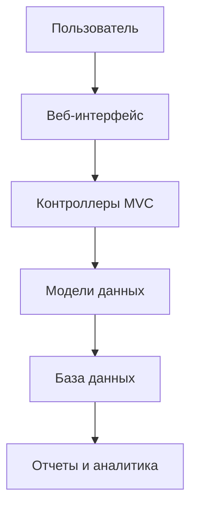

<!-- Шапка с баннером -->

# 🏛️ University Management System

**Профессиональная система управления университетом на ASP.NET Core MVC**

[🚀 Демо](#-демо) • [📦 Установка](#-установка) • [✨ Функции](#-функции) • [🏗️ Архитектура](#️-архитектура) • [📷 Скриншоты](#-скриншоты)

---

## 📖 О проекте

**University Management System** — это полнофункциональное веб-приложение для администрирования учебного заведения. Система предоставляет современный интерфейс для управления факультетами, группами и студентами с поддержкой всех CRUD операций.

✨ Ключевые функции
🎓 Управление образовательным процессом
Модуль	Описание	Статус
🎯 Факультеты	Полное управление факультетами университета	✅ Готово
👥 Группы	Создание и редактирование учебных групп	✅ Готово
👨‍🎓 Студенты	Управление студенческими данными	✅ Готово
📊 Панель аналитики	Визуализация статистики	🚧 В разработке
📅 Расписание	Управление учебным расписанием	🔜 Планируется
🔧 Технические возможности
✅ Полный CRUD для всех сущностей

✅ Поиск и фильтрация с пагинацией

✅ Валидация данных на стороне сервера и клиента

✅ Адаптивный дизайн (мобильные устройства + десктоп)

✅ Локализация (поддержка нескольких языков)

🚧 Экспорт данных в Excel/PDF

🔜 REST API для интеграции

🚀 Быстрый старт
📋 Предварительные требования
bash
# Проверьте установленные компоненты
dotnet --version          # Должен быть 6.0 или выше
node --version           # Для фронтенд зависимостей (опционально)
sqlcmd -?                # Для SQL Server (опционально)
🛠️ Установка за 5 минут

 
<b>🎯 Способ 1: Клонирование и запуск</b>

bash
# 1. Клонируйте репозиторий
git clone https://github.com/ВАШ_ЛОГИН/UniversityWebApp.git
cd UniversityWebApp

# 2. Настройте базу данных (SQLite автоматически)
# Или для SQL Server отредактируйте appsettings.json

# 3. Восстановите зависимости и запустите миграции
dotnet restore
dotnet ef database update

# 4. Запустите приложение
dotnet run

# 5. Откройте в браузере
# https://localhost:7000 или http://localhost:5000

 
<b>🎮 Способ 2: Через Visual Studio 2022</b>

Откройте UniversityWebApp.sln в Visual Studio 2022

Восстановите NuGet пакеты (автоматически)

Нажмите F5 для запуска

Приложение откроется с предустановленными тестовыми данными

💡 Рекомендуется использовать профиль запуска "UniversityWebApp"

 
<b>🐳 Способ 3: Через Docker (продвинутый)</b>

dockerfile
# Сборка образа
docker build -t university-app .

# Запуск контейнера
docker run -p 8080:80 -e ASPNETCORE_ENVIRONMENT=Production university-app

# Доступ по адресу
# http://localhost:8080
📝 Dockerfile включен в репозиторий

🏗️ Архитектура системы
📁 Структура проекта
text
UniversityWebApp/
├── 📂 Controllers/           # Контроллеры MVC
│   ├── HomeController.cs
│   ├── FacultyController.cs
│   ├── GroupController.cs
│   └── StudentController.cs
├── 📂 Models/               # Модели предметной области
│   ├── Faculty.cs
│   ├── Group.cs
│   ├── Student.cs
│   └── ViewModels/         # Модели представления
├── 📂 Views/                # Razor представления
│   ├── Home/
│   │   ├── Index.cshtml
│   │   └── Privacy.cshtml
│   ├── Faculties/
│   │   ├── Index.cshtml    # Список факультетов
│   │   ├── Create.cshtml   # Создание
│   │   ├── Edit.cshtml     # Редактирование
│   │   └── Details.cshtml  # Детали
│   └── Shared/             # Общие компоненты
│       ├── _Layout.cshtml  # Основной макет
│       └── _Validation.cshtml
├── 📂 Data/                 # Слой доступа к данным
│   ├── ApplicationDbContext.cs
│   └── Repositories/       # Паттерн Repository
├── 📂 Migrations/           # Миграции EF Core
├── 📂 Services/            # Бизнес-логика
│   ├── IFacultyService.cs
│   └── FacultyService.cs
├── 📂 wwwroot/             # Статические файлы
│   ├── css/
│   │   └── site.css       # Кастомные стили
│   ├── js/
│   │   └── site.js        # Кастомные скрипты
│   └── lib/               # Библиотеки (Bootstrap, jQuery)
├── 📜 Program.cs           # Точка входа
├── 📜 appsettings.json     # Конфигурация
└── 📜 UniversityWebApp.csproj
🗄️ Схема базы данных
sql
-- Основные таблицы
CREATE TABLE Faculties (
    Id INT PRIMARY KEY,
    Name NVARCHAR(100) NOT NULL,
    DeanName NVARCHAR(100),
    CreatedDate DATETIME DEFAULT GETDATE()
);

CREATE TABLE Groups (
    Id INT PRIMARY KEY,
    Name NVARCHAR(50) NOT NULL,
    FacultyId INT FOREIGN KEY REFERENCES Faculties(Id)
);

CREATE TABLE Students (
    Id INT PRIMARY KEY,
    FirstName NVARCHAR(50) NOT NULL,
    LastName NVARCHAR(50) NOT NULL,
    Email NVARCHAR(100),
    GroupId INT FOREIGN KEY REFERENCES Groups(Id),
    EnrollmentDate DATE
);
📷 Скриншоты

🏠 Главная страница
https://via.placeholder.com/800x400/4A6572/FFFFFF?text=Dashboard+with+University+Statistics

📋 Список студентов
https://via.placeholder.com/800x400/344955/FFFFFF?text=Students+List+with+Search+and+Filters

📝 Редактирование профиля
https://via.placeholder.com/800x400/232F34/FFFFFF?text=Edit+Student+Form+with+Validation

Замените placeholder-изображения на реальные скриншоты вашего приложения

⚙️ Настройка окружения
Конфигурационные файлы
json
// appsettings.json (общие настройки)
{
  "Logging": {
    "LogLevel": {
      "Default": "Information"
    }
  },
  "ConnectionStrings": {
    "DefaultConnection": "Data Source=university.db"
  },
  "AllowedHosts": "*"
}
json
// appsettings.Development.json (только для разработки)
{
  "DetailedErrors": true,
  "Logging": {
    "LogLevel": {
      "Default": "Debug"
    }
  }
}
Переменные окружения
bash
# Для разработки
export ASPNETCORE_ENVIRONMENT=Development
export DB_CONNECTION="Server=localhost;Database=UniversityDev;Trusted_Connection=True;"

# Для продакшена
export ASPNETCORE_ENVIRONMENT=Production
export DB_CONNECTION="Server=prod-server;Database=UniversityProd;User Id=..."
🧪 Тестирование
Запуск тестов
bash
# Запустить все тесты
dotnet test

# Запуск с покрытием кода
dotnet test --collect:"XPlat Code Coverage"

# Запуск конкретного проекта тестов
dotnet test ./tests/UniversityWebApp.Tests
Пример модульного теста
csharp
[Fact]
public void CreateStudent_ValidData_ReturnsSuccess()
{
    // Arrange
    var student = new Student { 
        FirstName = "Иван", 
        LastName = "Иванов",
        Email = "ivan@example.com"
    };

    // Act
    var result = _studentService.Create(student);

    // Assert
    Assert.True(result.Success);
    Assert.Equal("Иван", result.Data.FirstName);
}
🤝 Вклад в проект
Мы рады вашим пулл-реквестам! Вот как можно помочь:

🐛 Сообщение об ошибке
Проверьте существующие issues

Создайте новый issue с шаблоном:

Описание проблемы

Шаги воспроизведения

Ожидаемое поведение

Скриншоты/логи

💡 Предложение улучшения
Обсудите идею в Discussions

Создайте issue с меткой enhancement

🔧 Процесс разработки
bash
# 1. Форкните репозиторий
# 2. Создайте ветку для фичи
git checkout -b feature/amazing-feature

# 3. Закоммитьте изменения
git commit -m 'feat: add amazing feature'

# 4. Запушьте ветку
git push origin feature/amazing-feature

# 5. Откройте Pull Request
📊 Roadmap
Версия 1.0 (Текущая) ✅
Базовые CRUD операции

Адаптивный дизайн

SQLite поддержка

Валидация данных

Версия 1.1 (В разработке) 🚧
Аутентификация (ASP.NET Core Identity)

Ролевая модель (Admin, Teacher, Student)

Экспорт в Excel

Панель аналитики

Версия 2.0 (Планируется) 🔮
REST API

Мобильное приложение (React Native)

Система учета успеваемости

Онлайн-зачетная книжка

Календарь событий

👥 Команда проекта
<table> <tr> <td align="center"> <a href="https://github.com/ВАШ_ЛОГИН">    <b>Ваше Имя</b> </a>   👑 Главный разработчик </td> </tr> </table>
📄 Лицензия
Распространяется под лицензией MIT. См. файл LICENSE для подробностей.

text
MIT License

Copyright (c) 2024 University Management System

Разрешается свободное использование, копирование, изменение и распространение
данного программного обеспечения при условии сохранения уведомления об авторских правах.
🌟 Благодарности
ASP.NET Core Documentation

Bootstrap Team

Entity Framework Core

Все контрибьюторы

🌐 Полезные ссылки
📚 Документация • 🐛 Issues • 💬 Discussions • 📦 Releases

⭐ Если проект вам понравился, поставьте звезду на GitHub!

https://api.star-history.com/svg?repos=%D0%92%D0%90%D0%A8_%D0%9B%D0%9E%D0%93%D0%98%D0%9D/UniversityWebApp&type=Date

